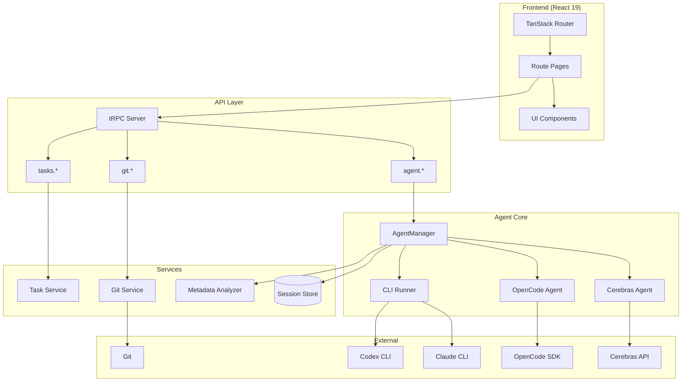
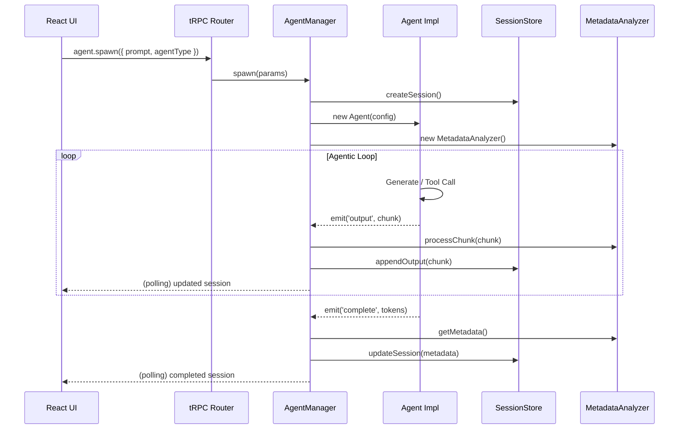
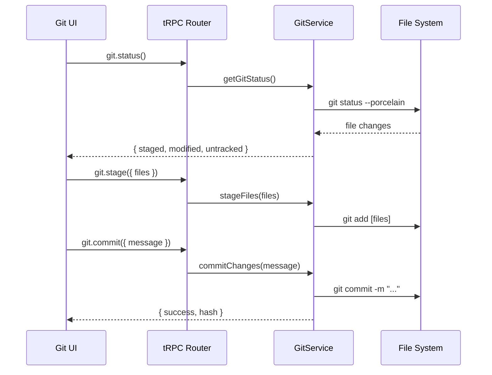

# Codebase Map

> Auto-generated by Cartographer. Last mapped: 2026-01-13

## System Overview

**Agentz** is a full-stack multi-agent control panel that spawns and manages multiple AI coding agents (Claude CLI, Codex CLI, OpenCode, Cerebras GLM) for autonomous software development tasks. It provides real-time session monitoring, task management with AI-powered planning, and integrated git workflows.



## Directory Structure

```
agentz/
├── .claude/skills/           # Claude Code skills
│   └── cartographer/         # Codebase mapping skill
├── src/
│   ├── agent/               # Frontend agent types (duplicate)
│   ├── components/          # React components
│   │   ├── agents/          # Agent session UI
│   │   ├── git/             # Git workflow components
│   │   └── ui/              # Reusable UI primitives
│   ├── lib/                 # Core libraries
│   │   ├── agent/           # Agent system (main)
│   │   └── skills/          # Skills framework
│   ├── routes/              # TanStack file-based routes
│   │   ├── agents/          # Agent session routes
│   │   ├── api/trpc/        # tRPC handler
│   │   └── tasks/           # Task management routes
│   └── trpc/                # tRPC routers
├── tasks/                   # Markdown task files
├── data/                    # Runtime data (git-ignored)
└── docs/                    # Documentation
```

## Module Guide

### Agent System (`src/lib/agent/`)

**Purpose**: Core multi-agent orchestration engine supporting 4 agent types.

**Entry point**: `src/lib/agent/index.ts`

| File | Purpose | Tokens |
|------|---------|--------|
| types.ts | Type definitions (AgentSession, AgentType, status enums) | 1,296 |
| manager.ts | AgentManager - spawns/manages agents, EventEmitter | 2,020 |
| cerebras.ts | Cerebras GLM agent with SDK + tool calling | 2,761 |
| opencode.ts | OpenCode SDK agent with embedded server | 1,804 |
| cli-runner.ts | Claude/Codex CLI subprocess runner | 3,802 |
| tools.ts | Tool implementations (read, write, edit, bash, glob, grep) | 2,575 |
| session-store.ts | File-based session persistence | 892 |
| metadata-analyzer.ts | Real-time metrics computation | 2,473 |
| git-service.ts | Git command wrapper with safety checks | 4,304 |
| task-service.ts | Markdown task file management | 1,952 |
| config.ts | Agent config constants, model lists | 540 |
| status.ts | Status helpers, colors, labels | 386 |

**Key Exports**:
- `AgentManager`, `getAgentManager()` - Singleton orchestrator
- `CerebrasAgent`, `OpencodeAgent`, `CLIAgentRunner` - Agent implementations
- `getSessionStore()` - Session persistence
- `runTool()`, `TOOL_DEFINITIONS` - Tool framework

**Patterns**:
- Factory pattern: Manager routes to correct agent implementation
- Observer pattern: EventEmitter for output/status/error events
- Singleton pattern: Single manager and store instances

---

### tRPC API (`src/trpc/`)

**Purpose**: Type-safe RPC layer connecting frontend to backend services.

**Entry point**: `src/trpc/index.ts`

| File | Purpose | Tokens |
|------|---------|--------|
| router.ts | Root router combining sub-routers | 94 |
| agent.ts | Agent CRUD + spawn/cancel mutations | 740 |
| git.ts | Git queries + mutations | 719 |
| tasks.ts | Task CRUD + AI agent integration | 2,278 |
| system.ts | System info (workingDir) | 69 |
| trpc.ts | tRPC initialization | 69 |
| context.ts | Request context factory | 60 |

**Exports**: `appRouter`, `AppRouter` (type)

**Namespaces**:
- `agent.*` - spawn, cancel, delete, get, list, availableTypes
- `git.*` - status, branches, commits, diff, stage, commit, push
- `tasks.*` - list, get, save, create, createWithAgent, reviewWithAgent

---

### Frontend Components (`src/components/`)

**Purpose**: React components for agent sessions, git workflows, and UI primitives.

| Module | Files | Tokens | Description |
|--------|-------|--------|-------------|
| agents/ | 4 | 5,900 | Session progress, task list, thread sidebar |
| git/ | 10 | 17,296 | Branch select, diff panel, file list, commit form |
| ui/ | 13 | 5,633 | Button, badge, dialog, tabs, tooltip, checkbox |
| Other | 2 | 1,083 | providers.tsx, theme.tsx |

**Key Components**:
- `ThreadSidebar` - Rich metadata display with 2s polling
- `DiffPanel` - Complex diff viewer with inline comments + agent integration
- `FileList` - Tabbed staged/modified/untracked file list
- `StreamingMarkdown` - Renders streaming AI output

**Styling**: Tailwind CSS + CVA variants + Radix UI primitives

---

### Routes (`src/routes/`)

**Purpose**: File-based routing with TanStack Router.

| Route | File | Purpose |
|-------|------|---------|
| `/` | index.tsx | New agent creation form |
| `/agents/$sessionId` | agents/$sessionId.tsx | Session detail with output stream |
| `/git` | git.tsx | Git workflow UI |
| `/tasks` | tasks.tsx | Task management with AI planning |
| `/api/trpc/*` | api/trpc/$.ts | tRPC HTTP handler |

**Patterns**:
- Polling for real-time updates (1-5s intervals)
- URL state via search params (`?path=`)
- SSR with TanStack Start

---

### Skills Framework (`src/lib/skills/`)

**Purpose**: Pluggable skill system for reusable agent behaviors.

| File | Purpose | Tokens |
|------|---------|--------|
| types.ts | Skill, SkillContext, SkillEvent definitions | 847 |
| registry.ts | Skill registration and trigger-based lookup | 654 |

**Note**: Framework is defined but no skills are registered yet. The Cartographer skill in `.claude/skills/` is a Claude Code skill (different system).

---

## Data Flow

### Agent Session Lifecycle



### Git Workflow



## Conventions

### Code Style
- **TypeScript**: Strict mode, no implicit any
- **Imports**: `@/` alias for `src/`
- **Exports**: Barrel exports via `index.ts`
- **Naming**: camelCase functions, PascalCase components/types

### Component Patterns
- ForwardRef for form components
- CVA for variant management
- Compound components (Dialog, Tabs)
- Radix UI for accessible primitives

### State Management
- **Server state**: tRPC + React Query
- **URL state**: Search params for selection
- **Local state**: useState for UI
- **Theme**: Cookie-based with SSR script

### Error Handling
- Consistent format: `{ success: boolean, error?: string }`
- Error sanitization (strips paths/credentials)
- Try-catch in async operations

## Gotchas

### Performance
1. **Session store writes to disk on every update** - Consider batching for high-frequency updates
2. **Polling intervals**: 1s (active sessions), 2s (metadata), 5s (status/tasks)
3. **Tool outputs truncated at 50KB** (Cerebras agent)

### Agent Differences
| Agent | Context | Method | Notes |
|-------|---------|--------|-------|
| Cerebras | 8K-131K | SDK | Requires CEREBRAS_API_KEY |
| OpenCode | Varies | Embedded server | Random port, must cleanup |
| Claude | 200K | CLI subprocess | Checks multiple paths |
| Codex | 128K | CLI subprocess | CODEX_HOME auto-set |

### Security
- **Git errors sanitized** - Prevents credential/path leaks
- **Task paths whitelisted** - Only specific directories allowed
- **Dangerous bash commands blocked** - Cerebras agent blacklist
- **Branch names validated** - No .., ~, ^, spaces

### Type Gotchas
- `AgentOutputChunk.metadata` must be JSON-serializable (no `unknown`)
- Two `types.ts` files exist (`src/agent/` and `src/lib/agent/`)
- `SessionStatus` has active vs terminal states - use helpers

### UI/UX
- **No WebSockets** - Uses polling for updates
- **Theme flash prevention** - Requires `<ThemeScript />` in head
- **Route tree auto-generated** - `src/routeTree.gen.ts` is git-ignored

## Navigation Guide

### To add a new agent type
1. Create agent class in `src/lib/agent/` (extend EventEmitter pattern)
2. Add type to `AgentType` union in `src/lib/agent/types.ts`
3. Add case in `AgentManager.runAgent()` switch statement
4. Add availability check in `cli-runner.ts` → `getAvailableAgentTypes()`
5. Add label in `src/lib/agent/config.ts` → `agentTypeLabel`
6. Add icon in `src/routes/__root.tsx` → `AgentTypeIcon`

### To add a new tRPC procedure
1. Add procedure to appropriate router in `src/trpc/`
2. Router auto-merges - no changes to `router.ts` needed
3. Call from frontend via `trpc.[namespace].[procedure]`

### To add a new route
1. Create file in `src/routes/` following naming convention
2. Route tree regenerates automatically on dev server
3. Dynamic params: `$param`, Catch-all: `$.ts`

### To add a new UI component
1. Create in `src/components/ui/`
2. Export from `src/components/ui/index.ts`
3. Use CVA for variants, ForwardRef for form elements

### To add a new tool
1. Add to `TOOL_DEFINITIONS` in `src/lib/agent/tools.ts`
2. Implement function with `{ success, content }` return type
3. Add case in `runTool()` dispatcher

## Tech Stack Summary

| Layer | Technology |
|-------|------------|
| Framework | React 19, TanStack Router/Start |
| API | tRPC v11, React Query |
| Styling | Tailwind CSS v4, Radix UI |
| Build | Vite 7, Vinxi |
| AI SDKs | Cerebras SDK, OpenCode SDK |
| Validation | Zod |
| Language | TypeScript 5.9 (strict) |
